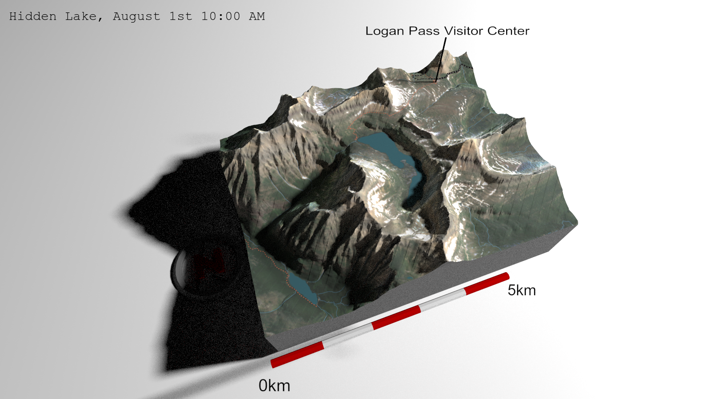
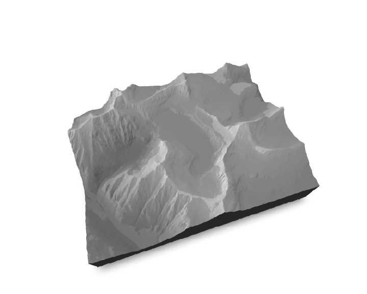
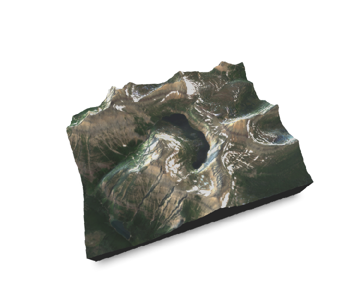
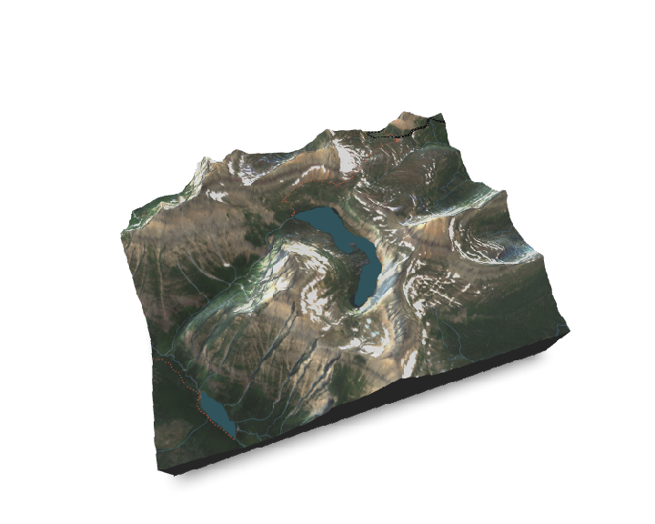
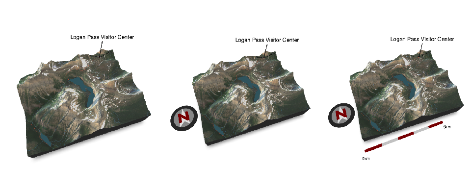
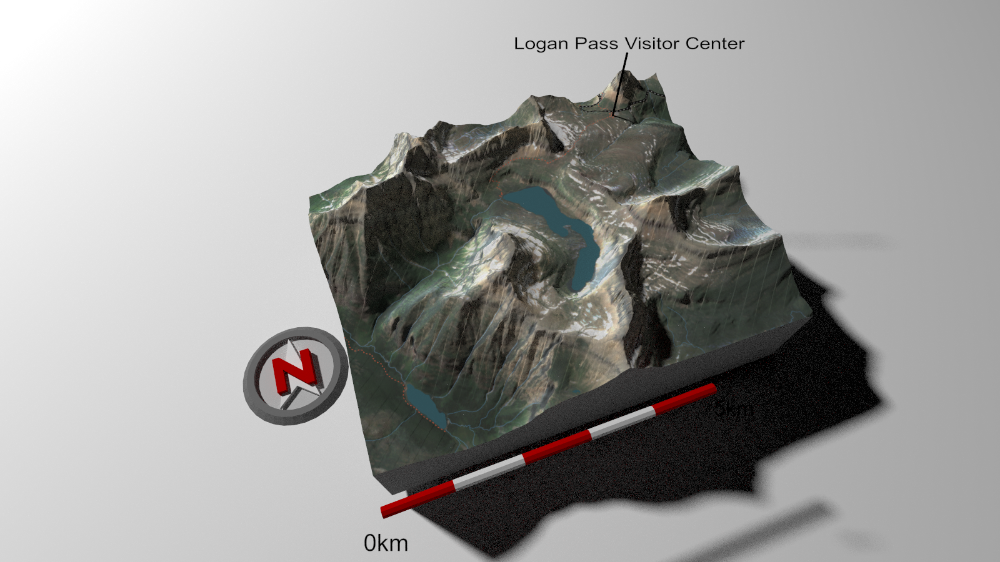

# realmaps



## Overview

This repository is intended to document and share tools and processes
for generating realistic, shaded 3d maps for the purposes of
communicating research using program R. There are numerous similar
tutorials and vignettes available, however, no single guide has
encompassed each of the tools and methods employed here.

Special attention should be given to the amazing work by [Tyler
Morgan-Wall](https://www.tylermw.com), who developed
[`rayshader`](https://www.rayshader.com), and has written numerous
tutorials. Additionally, the [`osmdata`](hidden_lake_aug1.mp4) and
[`suncalc`](https://github.com/datastorm-open/suncalc) packages proved
invaluable for sourcing spatial data and for creating temporally
realistic lighting, respectively.

## Sourcing Data

Google Earth Engine is incredibly valuable for streamlining the process
of acquiring, wrangling, and standardizing remotely sensed data for use
in analyses or, as in this case, for the purpose of mapping. Below is an
Earth Engine script to generate three data products:

1.  A Digital Elevation Model (DEM)

2.  A cloud-free color image mosaic for a given month

3.  A binary raster identifying pixels covered by water during a given
    month

<details>
<summary>
<b>Earth Engine script</b>
</summary>

``` js
// ----------------------------------------------------------------------------- 
// Wrangle and download satellite data for mapping in program R
// ----------------------------------------------------------------------------- 

// Specify region of interset
var roi = ee.Geometry.Rectangle([-113.7000, 48.65, -113.80, 48.70]); 

// Specify desired output resolution and projection
var res = 10
var transform = ee.Projection('EPSG:32612');


// Load a Digital Elevation Model, save to drive -------------------------------

var dem = ee.Image("USGS/3DEP/10m")
  .clip(roi).
  // reproject for based on specified transformation and resolution
  reproject(transform, null, res)

// Save output to drive
Export.image.toDrive({
  image: dem,                         // Name of image to export
  description: 'hidden_lake_dem',     // Export name for file
  scale: res,                         // Define scale in meters
  region: roi,                        // Define region to export
  fileFormat: 'GeoTIFF',              // Define desired file format
  maxPixels: 200000000                // Modify as needed to save large imgs
});


// Load Sentinel 2 imagery, mask cloudy pixels --------------------------------- 

// function to mask clouds from S2 data
function maskS2clouds(image) {
  var qa = image.select('QA60');

  // Bits 10 and 11 are clouds and cirrus, respectively.
  var cloudBitMask = 1 << 10;
  var cirrusBitMask = 1 << 11;

  // Both flags should be set to zero, indicating clear conditions.
  var mask = qa.bitwiseAnd(cloudBitMask).eq(0)
      .and(qa.bitwiseAnd(cirrusBitMask).eq(0));

  return image.updateMask(mask);
}

// load imagery
var S2col = ee.ImageCollection("COPERNICUS/S2_SR")
    .filter(ee.Filter.lt('CLOUDY_PIXEL_PERCENTAGE',20))      // reduce clouds
    .map(maskS2clouds)


// Generate median RGB color image from ---------------------------------------------

var s2_median = S2col
  .median() // Take the median of all the cloud-free pixels to create one image
  .clip(roi);

// define visualization arguments for natural color image
var s2_color_vis = {bands: ['B2', 'B3', 'B4'], min: 0, max: 3000, gamma: 1.4};

// preview on map
Map.addLayer(s2_median, s2_color_vis, 'S2 Color Image')

// create RGB image for export
var s2_rgb = s2_median
  .visualize({bands: ['B4', 'B3', 'B2'], min: 0, max: 3000})
  .reproject(transform, null, res);

// Save output to drive
Export.image.toDrive({
  image: s2_rgb,                      // Name of image to export
  description: 'hidden_lake_rgb',     // Export name for file
  scale: res,                         // Define scale in meters
  region: roi,                        // Define region to export
  fileFormat: 'GeoTIFF',              // Define desired file format
  maxPixels: 200000000                // Modify as needed to save large imgs
});


// Generate layer with pixels classified as water during August ----------------

var water = S2col
  // filter col to the month of August during the year of interest
  .filterDate(ee.Date.fromYMD(2021, 8, 1), ee.Date.fromYMD(2021, 8, 31))
  .map(function(img){return img.select('SCL')})
  // get most common SCL value during time period  
  .mode()
  // Get SCL value equal to 6 (water)
  .eq(6)
  .clip(roi);


// preview on map
Map.addLayer(water, null, 'Water Layer', 1);

// reproject for based on specified transformation and resolution
var water_proj = water.reproject(transform, null, res)

// Save output to drive
Export.image.toDrive({
  image: water_proj,                  // Name of image to export
  description: 'hidden_lake_water',   // Export name for file
  scale: res,                         // Define scale in meters
  region: roi,                        // Define region to export
  fileFormat: 'GeoTIFF',              // Define desired file format
  maxPixels: 200000000                // Modify as needed to save large imgs
});
```

</details>

For the sake of simplicity in reproducibility, the raster files
`hidden_lake_dem.tiff`, `hidden_lake_rgb.tiff`, and
`hidden_lake_water.tiff` are included in the data folder of this
repository.

## Preparing Data for Mapping

### Define the area of interest

First, lets create a bounding box for the area of interest. In this
case: Hidden Lake, Glacier National Park, USA. From here on, the extent
of map we build will be based on this bounding box.

Often I find it easier to specify bounding coordinates in latitude and
longitude and transform those to a different projection (as needed).

``` r
# Bounding box for Hidden Lake, Glacier National Park
x_min = -113.8
x_max = -113.7
y_min = 48.65
y_max = 48.7

bbox <-
  sf::st_bbox(
    c('xmin' = x_min, 'xmax' = x_max, 'ymax' = y_max, 'ymin' = y_min),
    crs = sf::st_crs(4326)
  ) |>
  sf::st_as_sfc() |>
  sf::st_transform(32612) |>
  sf::as_Spatial()
```

### Load and wrangle raster data

Now lets load the 10m raster data exported from Google Earth Engine.
We’ll crop it to the area of interest (i.e., bounding box) and convert
it into an array for use with `rayshader`. Note that the color (RGB)
image is actually a raster image with three color bands which needs to
be transposed after converting to a matrix to work with `rayshader`.

When running this script, note that `rayshader::raster_to_matrix()`
prints the dimensions of each matrix after conversion. These should all
be the same size – this is a good opportunity to verify that the area of
interest and resolution are consistent for each layer.

``` r
# Load local rasters -----------------------------------------------------------
elev <- 
  raster::raster("./data/hidden_lake_dem.tiff") |> 
  raster::crop(bbox)

# Load color imagery from Sentinel 2
s2_rgb <- 
  raster::stack("./data/hidden_lake_rgb.tiff") |>
  raster::crop(bbox)

water <- 
  raster::raster("./data/hidden_lake_water.tiff") |> 
  raster::crop(bbox) |>                               # crop to study area
  raster::reclassify(matrix(c(0, NA), nrow = 1)) |>   # convert 0 values to NA
  stars::st_as_stars() |>                             # convert to stars
  sf::st_as_sf(as_points = FALSE, merge = TRUE) |>    # convert to sf (polygon)
  smoothr::drop_crumbs(units::set_units(1000, m^2)) |># drop poly < unit area 
  smoothr::smooth(method = 'ksmooth', smoothness = 3) # smooth polygon


# Convert rasters to matrix for use with rayshader -----------------------------

elev_mat <- rayshader::raster_to_matrix(elev)

# FUNCTION to wrangle RGB data to work with rayshader
wrangle_rgb <- function(x){
  # The array must be transposed since rasters and arrays are oriented 
  # differently in R. aperm() is sued to perform a multi-dimensional transpose.
  r_mat = rayshader::raster_to_matrix(x[[1]])
  g_mat = rayshader::raster_to_matrix(x[[2]])
  b_mat = rayshader::raster_to_matrix(x[[3]])
  
  # create array
  rgb_array = array(0, dim = c(nrow(r_mat),ncol(r_mat),3))
  
  rgb_array[,,1] = r_mat/255 #Red layer
  rgb_array[,,2] = g_mat/255 #Blue layer
  rgb_array[,,3] = b_mat/255 #Green layer
  
  rgb_array = aperm(rgb_array, c(2,1,3))
  
  # enhance contrast
  scales::rescale(rgb_array,to=c(0, 1))
  
  return(rgb_array)
}

# Prepare rgb image overlay
rgb_img <- wrangle_rgb(s2_rgb)
```

<details>
<summary>
An aside about mapping water
</summary>

Did you notice that the water raster is converted to smoothed polygons?

My initial attempts at overlaying water were frustrating. Data from the
National Hydrography Dataset Plus (NHDPlus) were not great (e.g., lakes
should not climb steep slopes, dry islands should not be covered by lake
polygons, etc.). Further, the NHDPlus data does not depict temporal
variation and therefore is not suitable for making temporally accurate
maps.

Using remote-sensing products (as in the Google Earth Engine script) to
derive fine- temporal and spatial scale data has substantial advantages.
However, these raw data are raster images which results in pixelation
and, sometimes, individual pixel water bodies. To remedy those issues, I
converted the raster image to polygons (note that zeros are first
converted to NAs to avoid creating a polygon for non-water), removed
water bodies with an area less than 1000m^2, and used a kernel smoothing
algorithm to produce pretty polygons with rounded edges.

</details>

## Creating a map using `rayshader`

Now we are ready to create the foundation of our map using `rayshader`.
The elevation data are the most essential component of these maps.

Here, (and throughout use of the `rayshader`) it is important to specify
the scale of our resolution data. If the scale used does not match the
elevation data, the vertical relief will either be exaggerated (which
can be desirable; e.g., a two times exaggeration would be `z_sc = 5`) or
suppressed.

Note that most commands from `rayshader` have an `alphalayer` argument
which is used to adjust transparency. also note that we can save (and
add onto) different versions of the map to avoid re-computation.

Let’s start by making a simple shaded terrain model.

``` r
# Specify scale of elevation data (and other rasters)
z_sc = 10

# Create basemap
basemap <-
  elev_mat |>
  rayshader::height_shade(
    # white/gray palette to overlay sat imagery on. Adds some texture without
    # tinting the color of the output image
    texture = (grDevices::colorRampPalette(c("gray60", "#FFFFFF")))(256)
  ) |>
  rayshader::add_shadow(rayshader::ray_shade(elev_mat,lambert=FALSE), 0.7) |>
  rayshader::add_overlay(
    rayshader::sphere_shade(
      elev_mat,
      texture = "bw",
      zscale = z_sc,
      colorintensity = 5
    ),
    alphalayer = 0.6
  )
```

We can now visualize it through an interactive render. Note that here
only a static snapshot is visible but if running `rayshader::plot_3d()`
on a local computer the map will render in an interactive window.

``` r
basemap |> 
rayshader::plot_3d(elev_mat, zscale = z_sc)
```

<!-- -->

The shading here is fairly basic (and uninspiring), however, since the
goal here is to overlay satellite imagery this is a good base to work
off of. If building maps without satellite imagery, `rayshader` offers a
lot of tools coloring maps by topography alone.

Now, lets overlay the RGB image on the terrain model and look at the two
dimensional map.

``` r
basemap_rgb <-
  basemap |>
  rayshader::add_overlay(
    rgb_img,
    alphalayer = .8
  )

basemap_rgb |> 
rayshader::plot_3d(elev_mat, zscale = z_sc)
```

<!-- -->

### Download spatial features from OpenStreetMap

The RGB map is a good start, but often it is desirable to overlay
additional spatial features such as roads, trails, and boundaries.

Lets start by downloading the spatial data we are interested in from
OpenStreetMap (OSM). Here we download trails, waterways (i.e., streams)
and roads. A bunch more categories of data exist which can all be
downloaded using the `osmdata` package.

``` r
# Download OSM data ------------------------------------------------------------

# convert bounding box to lat lon to work with osmdata
osm_bbox <-
  bbox |>
  sf::st_as_sfc() |>
  sf::st_transform(crs = 4326) |>
  sf::st_bbox()

trails <-
  osmdata::opq(
    bbox = osm_bbox,
    timeout = 25
  ) |>
  osmdata::add_osm_feature(
    key = "highway",
    value = c("path", "footway", "steps")
  ) |>
  osmdata::osmdata_sf() |>
  {\(x) x$osm_lines}() |>
  sf::st_transform(32612)

waterway <-
  osmdata::opq(
    bbox = osm_bbox,
    timeout = 25
  ) |>
  osmdata::add_osm_feature(
    key = "waterway"
  ) |>
  osmdata::osmdata_sf() |>
  {\(x) x$osm_lines}() |>
  sf::st_transform(32612)

roads <-
  osmdata::opq(
    bbox = osm_bbox,
    timeout = 25
  ) |>
  osmdata::add_osm_feature(
    key = "highway",
    value = c(
      "motorway",
      "trunk",
      "primary",
      "secondary",
      "tertiary"
    )
  ) |>
  osmdata::osmdata_sf() |>
  {\(x) x$osm_lines}() |>
  sf::st_transform(32612)
```

### Overlaying spatial data

Now that we have all the additional data we need, lets add the following
layers to our map:

1.  Streams

2.  Water (i.e., the satellite derived set of water polygons)

3.  Trails

4.  Roads

Note that these appear in the order they are added (i.e., the last layer
to be added will be on top of the other layers). We can also employ a
nice trick by adding the same feature multiple times using different
visualization arguments. For example, below roads are added twice: first
as a thick black line and second as a narrow white striped line on top.

<details>
<summary>
Using a function to overlay features on a base map
</summary>

Here, overlay of spatial features is wrapped within a function
`add_osm_features`. While this is not absolutely necessary, it will be
useful later on when producing high quality renders. Specifically,
`rayshader::render_highquality` uses its own ray shading process so it
is preferable to use an unshaded model. By specifying a function to
overlay spatial features now it will facilitate making an unshaded model
later on.

</details>

</br>

``` r
# Add features from OSM to basemap
add_osm_features <- function(basemap){
  basemap |> 
  rayshader::add_overlay(
    rayshader::generate_line_overlay(
      waterway, 
      extent = raster::extent(elev),
      linewidth = 1, 
      color = "skyblue2", 
      lty = 1,
      heightmap = elev_mat
    ),
    alphalayer = 0.6
  ) |> 
  # add water layer based on sat imagery
  rayshader::add_overlay(
    rayshader::generate_polygon_overlay(
      water,
      extent = raster::extent(elev),
      heightmap = elev_mat,
      palette = "#4e7982", # imhof3
      linecolor = "#4e7982",
      linewidth = 0
    )
  ) |> 
  # add trails to map
  rayshader::add_overlay(
    rayshader::generate_line_overlay(
      trails, 
      extent = raster::extent(elev),
      linewidth = 2, 
      color = "salmon2", 
      lty = 3,
      heightmap = elev_mat
    ),
    alphalayer = 0.9
  ) |>
  # add highways to map
  rayshader::add_overlay(
    rayshader::generate_line_overlay(
      roads, 
      extent = raster::extent(elev),
      linewidth = 6, 
      color = "black", 
      lty = 1,
      heightmap = elev_mat
    ),
    alphalayer = 0.9
  ) |> 
  # add center stripe to highway
  rayshader::add_overlay(
    rayshader::generate_line_overlay(
      roads, 
      extent = raster::extent(elev),
      linewidth = 1, 
      color = "white", 
      lty = 2,
      heightmap = elev_mat
    ),
    alphalayer = 1
  ) 
}

feature_map <- add_osm_features(basemap_rgb)
```

``` r
feature_map |> 
rayshader::plot_3d(elev_mat, zscale = z_sc)
```

<!-- -->

### Adding place marks

We can also call attention to specific landmarks by adding labels to the
3d map. This can be done using `rayshader::render_label` and specifying
the geographic coordinates for the label.

<details>
<summary>
A few comments about adding labels
</summary>

-   While the `rayshader::render_label()` function has arguments for
    `long` and `lat` those should really be thought of as `x` and `y`
    coordinates in whichever projection you are using.

-   In some instances, changing the angle of the map may cause the place
    mark to appear to move across the ground (e.g., when the view shifts
    the marker over lower elevation terrain). In this instance, the
    argument `offset` can be used to ‘bury’ the marker line in the
    ground (e.g., `offset = -1000`).

</details>

</br>

``` r
rayshader::render_label(
  elev_mat,
  long =  300001,
  lat = 5397146,
  altitude = 3500,
  zscale = z_sc,
  extent = raster::extent(elev),
  textcolor = "black",
  textsize = 1.3,
  linecolor = "black",
  linewidth = 2,
  text = "Logan Pass Visitor Center",
  relativez = FALSE
)
```

### Adding a compass and scalebar

Adding a north compass is easy using the `rayshader` package. While most
aspects can be customized, adjusting the position and size
(`compass_radius`) is often useful.

<details>
<summary>
Advanced compass positioning
</summary>

If the general position argument is not suitable, exact x, y, and z
coordinates can be provided. Note that these are the coordinates
*relative to the elevation matrix*. For example, the dimensions of the
elevation matrix (i.e., map) here are `756x582`.

</details>

</br>

``` r
rayshader::render_compass(position = "W", compass_radius = 100)
```

Adding a scale bar is not difficult, but requires a little more legwork.
Specifically, the “scale” of the map is not automatically detected so it
is necessary to: 1) calculate the length (or width; in distance units),
2) pick a desired length for the scale bar, 3) determine the proportion
of the length (or width) of the map that represents the scale bar
length, and 4) customize the position and graphics as desired.

Recall, this map has dimensions of `756x582` (rows x columns; X x Y) at
a 10m resolution. Thus, the dimensions in distances are
`x = 7560m, y = 5820m`. Let’s make a scale bar with 1km segments that is
5km in length. A little math to figure out the length of the bar
relative to the x axis: 5000*m*/7560*m* = 0.66

<details>
<summary>
Advanced scale bar positioning
</summary>

By default the scale bar will start at one edge of the map (relative to
the elevation matrix) and extend a portion of the length (e.g., `0.66`)
provided to the `scale_length` argument. However, it is often desirable
to shift the location for aesthetic reasons. For instance, we may want
to center the scale bar or correct for perspective when the map is
viewed off-axis. This is easily accomplished by providing a length-2
vector argument to `scale_length` which defines the start and end of the
scale bar. Small shifts along the axis (as in the example below) are
easily accomplished by adding (or subtracting) from the `scale_length`
vector.

</details>

</br>

``` r
rayshader::render_scalebar(
  position = "S",
  y = 220,
  limits = c(0, 5),
  scale_length = (c(0, 0.66) + 0.01),
  segments = 5,
  label_unit = "km",
  text_switch_side = TRUE,
  offset = 63,
  radius = 8
)
```

<!-- -->

## Producing High Quality Renders

The `rayshader::render_highquality` function can be used to produce a
raytraced version of the current rgl seen (i.e., realistically shadowed
versions of the above images).

``` r
  rayshader::render_highquality(
    "./out/hidden_lake_default_lighting.png",
    text_size = 35,
    line_radius = 2,
    text_offset = c(0, 20, 0),
    scale_text_size = 30,
    samples = 200,
    width = 1600,
    height = 900
  )
```



Aside from obvious visual differences, `render_highquality` offers
numerous advantages when trying to create temporally realistic maps.

By default, the resolution of the high-quality render is based on the
size of the size of the RGL preview window. The resolution can be
changed (especially useful when the render resolution exceeds monitor
resolution) using the `width` and `height` arguments.

The default light direction is 315 degrees with an altitude of 45
degrees above the horizon. This lighting angle is commonly used for
creating hill shade maps and will be familiar to viewers, *but* is not
realistic for a summer scene in high latitude areas of northern
hemisphere (e.g., Glacier National Park). Luckily, we can easily specify
the light altitude and direction.

### Spatially and temporarially accurate lighting

To create accurate lighting, we must first know where the sun *should*
be for a given date, time, and place. Using the `suncalc` package makes
obtaining that information easy.

<details>
<summary>
A note on wrangling the output from `suncalc`
</summary>

`suncalc`, for a specified date and time, returns the altitude of the
sun above the horizon in radians and the azimuth in radians *measured
from south to west*. Converting from radians to degrees (which are used
by `raysahder`) is straightforward: `radians * 180 / pi = degrees`. For
the azimuth, we also need to change the output to be measured clockwise
from north (0 deg) to north (360 deg). This can be done as below by
adding 180 to the azimuth value once it has been converted to degrees.

</details>

</br>

``` r
suncalc::getSunlightPosition(
  lon = -113.75,
  lat = 48.67,
  date = lubridate::as_datetime('2022-08-01T10:00:00', tz = "MST")
) |> 
dplyr::transmute(
  date = date,
  alt_deg = altitude * 180 / pi,
  az_deg = (azimuth * 180 / pi) + 180
)
```

    ##                  date  alt_deg   az_deg
    ## 1 2022-08-01 10:00:00 45.23221 118.8225

Using this information, we can now create temporally accurate lighting.
For example, let’s render the sun position at 10:00AM for Hanging Lake:

``` r
rayshader::render_highquality(
  filename = "./out/hidden_lake_Aug1_10am.png", 
  lightintensity = 850,
  lightdirection = 104,
  lightaltitude = 36,
  text_size = 35,
  line_radius = 2,
  text_offset = c(0, 20, 0), 
  samples = 200,
  scale_text_size = 30,
  width = 1600, 
  height = 900,
  title_text = 'Hiden Lake, Glacier National Park, August 1st 10:00 AM',
  title_color = "black",
  title_size = 30,
  title_bar_alpha = 0.9,
  title_font = "mono"
)
```


## Animate movement of the sun

To convey temporal we can enhance this figure by animating the position
of the sun (and hence the scene lighting) over the course of a day.

### Getting a list of sun positions

First, lets get a sequence of each minute for a given day in August.

``` r
tm <- 
  seq(
    lubridate::as_datetime('2022-08-01T00:00:00', tz = "MST"), 
    lubridate::as_datetime('2022-08-01T23:59:59', tz = "MST"), 
    by = "min"
  ) |> 
  lubridate::with_tz(tzone = "UTC")
```

Now, lets get the sun position for each of these times. Here, we also
convert altitude and azimuth to degrees, generate a new column for
intensity of light based on the sun altitude, and subset the data to 5
minute intervals and sun altitudes starting just below the horizon.

``` r
sun <-
  suncalc::getSunlightPosition(
  date = tm,
  lon = -113.75,
  lat = 48.67
) |> 
dplyr::transmute(
  dt = date,
  time = lubridate::as_datetime(dt) |> lubridate::with_tz("MST") |> format("%I:%M %p"),
  minute = lubridate::minute(dt),
  alt_deg = altitude * 180 / pi,
  az_deg = (azimuth * 180 / pi) + 180,
  intensity =
    dplyr::case_when(
      alt_deg < 0 ~ 100,
      alt_deg < 1 ~ 150,
      alt_deg < 5 ~ 250,
      alt_deg < 10 ~350,
      alt_deg < 15 ~450,
      alt_deg < 20 ~550,
      alt_deg < 25 ~600,
      alt_deg < 30 ~650,
      alt_deg < 35 ~700,
      alt_deg < 40 ~750,
      alt_deg < 45 ~800,
      alt_deg > 45 ~850
    )
) |>
# Subset to 5 minute intervals
dplyr::filter(minute%%5 == 0) |> 
# filter to near horizon
dplyr::filter(alt_deg > -5)
```

With these data, we can iterate through each row, producing a
high-quality render for each row of data. Note that rendering this many
images can take a long time to run and is highly dependent on the input
resolution, the output resolution, the number of samples, and the
computer’s processor.

``` r
for(i in 1:nrow(sun)){
  svMisc::progress(i, max.value = nrow(sun))
  rayshader::render_highquality(
    filename = paste0("./out/tmp/frame_", i, ".png"),
    lightintensity = sun$intensity[i],
    lightdirection = sun$az_deg[i],
    lightaltitude = sun$alt_deg[i],
    text_size = 35,
    line_radius = 2,
    text_offset = c(0, 20, 0),
    samples = 200,
    scale_text_size = 30,
    title_text = sun$time[i],
    title_font = "mono"
  )
}
```

The last step is to convert the series of renders or ‘frames’ into an
animation. Note that methods are provided for both `.gif` and `.mp4`.
For short, low-resolution, images `.gif` is convenient, however, for
larger projects using `.mp4` will produce result in dramatically smaller
file sizes.

``` r
# Convert .png files into .mp4 or .gif -----------------------------------------

# create list of frames
png_files <- sprintf("./out/tmp/frame_%d.png", 1:nrow(sun))

# Convert to mp4
av::av_encode_video(png_files, 'Hidden Lake Aug1.mp4', framerate = 30)

# Convert to gif
gifski::gifski(png_files, gif_file = "Aug1_animation_v2.gif", width = 1600, height = 900, delay = 0.03)
```

https://user-images.githubusercontent.com/37276224/167706908-62d398c1-62e8-4b45-bf91-1b7dbd0a97ac.mp4
